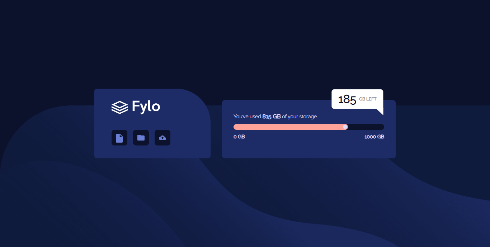

# Frontend Mentor - Fylo data storage component solution

This is a solution to the [Fylo data storage component challenge on Frontend Mentor](https://www.frontendmentor.io/challenges/fylo-data-storage-component-1dZPRbV5n). Frontend Mentor challenges help you improve your coding skills by building realistic projects. 

## Table of contents

- [Overview](#overview)
  - [The challenge](#the-challenge)
  - [Screenshot](#screenshot)
  - [Links](#links)
- [My process](#my-process)
  - [Built with](#built-with)
  - [What I learned](#what-i-learned)
- [Author](#author)

**Note: Delete this note and update the table of contents based on what sections you keep.**

## Overview

### The challenge

Users should be able to:

- View the optimal layout for the site depending on their device's screen size

### Screenshot

-Mobile version-


 -Desktop version



### Links

- Solution URL: (https://www.frontendmentor.io/solutions/testimonials-grid-section-rrnlUacP3_/)
- Live Site URL: (https://comfy-gaufre-8a1717.netlify.app/)

## My process

### Built with

- Semantic HTML5 markup
- CSS custom properties
- Flexbox
- CSS Grid
- Mobile-first workflow

### What I learned

```css
input[type=range] {
    -webkit-appearance: none;

    height: 1rem;
    border-radius: 1rem;
    background-color: var(--clr-neutral-500);
    overflow: hidden;
}

input[type=range]::-webkit-slider-thumb {
    -webkit-appearance: none;

    width: 1rem;
    height: 1rem;
    border-radius: 50%;
    background-color: var(--clr-neutral-200);
    cursor: pointer;
    border: 2px solid var(--clr-primary-200);
    box-shadow : -26rem 0 0 25.5rem var(--clr-primary-200);
}
```

## Author

- Frontend Mentor - [@yourusername](https://www.frontendmentor.io/profile/yourusername)
- Twitter - [@yourusername](https://www.twitter.com/yourusername)
